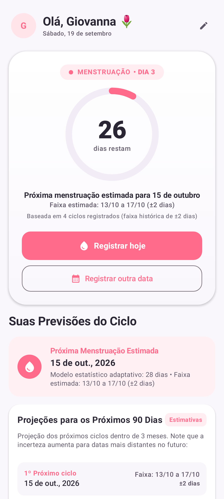
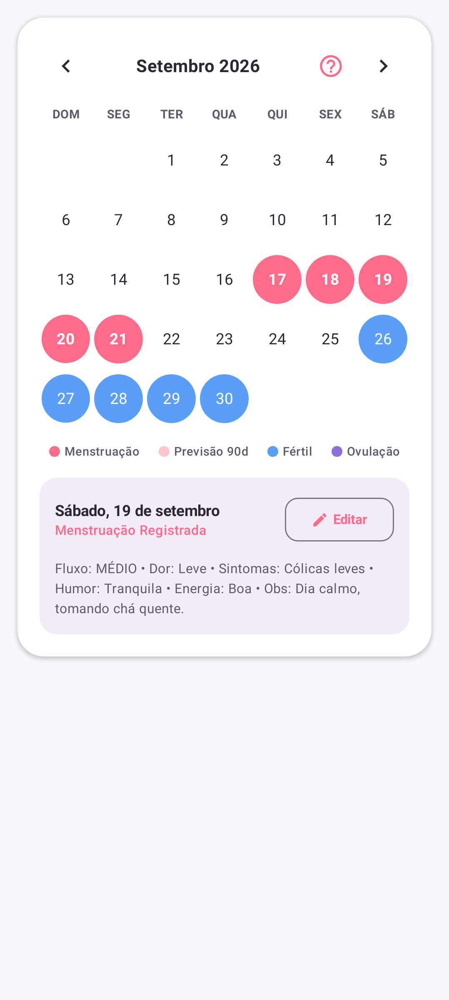
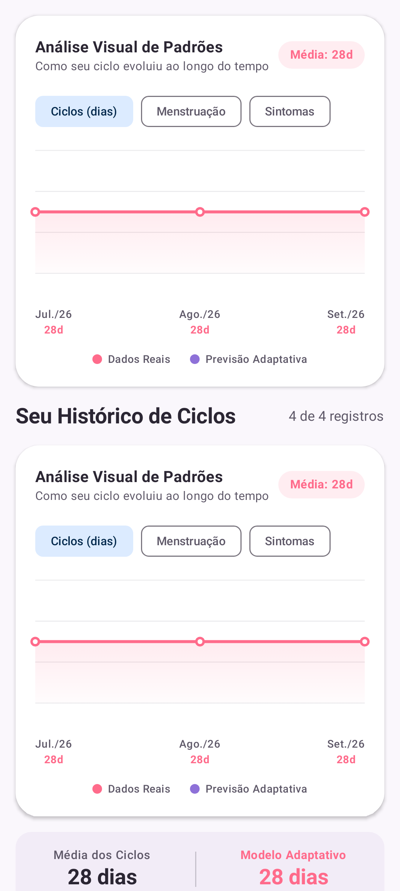
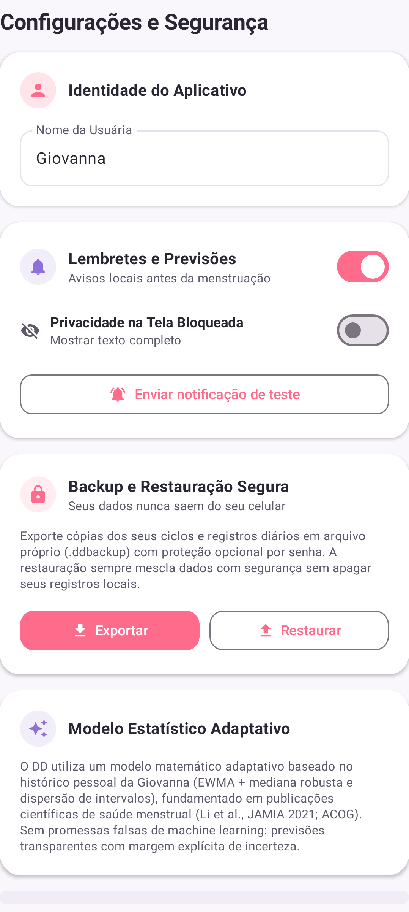

# DD • Diário Dela 🌷

Aplicativo Android pessoal, privado e offline para acompanhamento do ciclo menstrual e bem-estar, concebido e desenvolvido com todo carinho exclusivamente para a **Giovanna**, noiva do autor.

---

## 1. Identidade e Propósito

O **DD • Diário Dela** não é um aplicativo comercial genérico e nem uma plataforma para múltiplos usuários. Ele foi desenhado sob medida para atender à rotina da Giovanna, oferecendo uma experiência íntima, acolhedora e livre de distrações, anúncios, cadastros ou qualquer conexão externa.

* **Identidade nativa**: O app reconhece diretamente a Giovanna em sua interface ("*Olá, Giovanna 🌷*", "*Como você está hoje?*", "*Suas previsões*", "*Seu histórico*"), com possibilidade de ajuste de apelido ou preferências visuais.
* **Sem Contas ou Logins**: Não há telas de login, senhas de acesso à nuvem ou sincronizações com servidores terceiros. O dispositivo da Giovanna é o único guardião de suas informações.

---

## 2. Privacidade Absoluta e Arquitetura Offline-First

* **Zero Conexão com a Internet**: O manifesto do aplicativo não declara a permissão `android.permission.INTERNET`. É tecnicamente impossível para o aplicativo transmitir dados para qualquer servidor ou terceiros.
* **Sem Telemetria ou Analytics**: Dependências de serviços como Firebase, Google Analytics e SDKs de anúncios foram completamente expurgadas.
* **Proteção contra Vazamento em Backups Automáticos**:
  * `android:allowBackup="false"` no `AndroidManifest.xml`.
  * Regras estritas em `data_extraction_rules.xml` e `backup_rules.xml` bloqueando extrações automáticas de nuvem pelo Google Drive / Android Backup.
* **Backup e Restauração Soberana (SAF)**:
  * Exportação e importação manuais via **Storage Access Framework (SAF)**, gerando arquivos portáveis `.ddbackup`.
  * Criptografia ponta a ponta opcional via **AES-256-GCM** com derivação de chave **PBKDF2WithHmacSHA256** (65.536 iterações e salt aleatório de 16 bytes).
  * Algoritmo de restauração não destrutivo com **Merge Seguro e Idempotente**: registros existentes no dispositivo jamais são apagados; novos ciclos e registros diários são mesclados por UUID estável e datas únicas.

---

## 3. Base Científica e Modelo Estatístico Adaptativo

Abandonou-se qualquer terminologia de marketing enganosa (como "Inteligência Artificial de 96% de precisão"). Em seu lugar, opera um **Modelo Estatístico Adaptativo** determinístico, rigoroso e transparente, fundamentado na literatura ginecológica e biomédica contemporânea.

### Fundamentos Clínicos e Estatísticos
1. **Ponderação Adaptativa Histórica (EWMA + Mediana)**:
   * Aplica-se média móvel exponencialmente ponderada (*Exponentially Weighted Moving Average* - EWMA, $\alpha = 0.40$) combinada com a mediana dos ciclos para neutralizar o impacto de ciclos atípicos ou anovulatórios.
2. **Janelas de Incerteza Propositais**:
   * Previsões não são exibidas como dias pontuais absolutos, mas como intervalos com margem de incerteza crescente ($\pm 2$, $\pm 3$, $\pm 4$ dias), refletindo a variabilidade fisiológica natural.
3. **Projeções Futuras de 90 Dias**:
   * Calendário com estimativas dos próximos 3 ciclos, auxiliando na programação de compromissos e autocuidado.
4. **Sinais Discretos de Atenção à Saúde (ACOG)**:
   * Detecção de parâmetros fora da média populacional (ciclos menores que 21 dias ou superiores a 35 dias; períodos menstruais com sangramento superior a 8 dias), sugerindo discretamente acompanhamento ginecológico quando pertinente.

### Referências Científicas
* **Li, K., et al. (2021)**: *Characterizing the normal menstrual cycle and its variations using mobile application data.* **Journal of the American Medical Informatics Association (JAMIA)**, 28(10), 2169–2177. [PMID: 34534312](https://pubmed.ncbi.nlm.nih.gov/34534312/).
* **American College of Obstetricians and Gynecologists (ACOG)**: *Committee Opinion No. 651: Menstruation in Girls and Adolescents: Using the Menstrual Cycle as a Vital Sign.* **Obstet Gynecol**, 2015 (Reafirmado em 2022).
* **Fehring, R. J., et al. (2006)**: *Variability in the phases of the menstrual cycle.* **J Obstet Gynecol Neonatal Nurs**, 35(3), 376–384.

> [!IMPORTANT]
> **Aviso Clínico**: As previsões de ciclo, data provável de menstruação e janela fértil geradas pelo aplicativo são estimativas estatísticas destinadas exclusivamente ao autoconhecimento e conveniência pessoal. Elas **NÃO substituem avaliação médica ou ginecológica especializada** e **NUNCA devem ser utilizadas como método contraceptivo** ou para prevenção de gravidez.

---

## 4. Capturas de Tela da Interface

> [!NOTE]
> **Privacidade Garantida**: Todas as capturas de tela abaixo foram geradas automaticamente via testes de snapshot (Roborazzi) utilizando **estritamente dados sintéticos e fictícios** (ciclos simulados de 28 dias). Nenhum dado real da usuária foi utilizado.

| Início & Fase Atual | Calendário & Projeções 90 Dias |
| :---: | :---: |
|  |  |
| *Cumprimento carinhoso, anel de progresso, janela de incerteza e próximas fases.* | *Mapeamento visual de fases, projeção de 3 ciclos futuros e detalhes do dia.* |

| Histórico & Gráficos | Ajustes & Backup Seguro |
| :---: | :---: |
|  |  |
| *Estatísticas adaptativas, alternância de métricas e listagem detalhada.* | *Modo de notificação privada, teste sonoro e backup com senha (SAF).* |

---

## 5. Arquitetura Técnica

* **Linguagem**: Kotlin 2.2.10
* **UI Toolkit**: Jetpack Compose com Material Design 3 e suporte a temas claros/escuros
* **Banco de Dados**: Room 2.7.0 (Schema versão 2, exportação ativada via KSP)
  * `cycle_records`: Registro de menstruações com chave natural, timestamps e identificador estável `uuid`.
  * `daily_logs`: Registro diário granular (intensidade de fluxo, nível de dor, sintomas, humor, energia, sono, muco cervical, notas livres).
* **Migrações**: `MIGRATION_1_2` com preservação estrita de todos os dados históricos da versão 1, enriquecendo-os com UUIDs únicos sem alterar ou descartar colunas preexistentes.
* **Notificações**:
  * Ícone monocromático elegante (`ic_dd_notification.xml`).
  * Toque customizado suave e delicado (`dd_notification.wav` em pentatônica suave).
  * Modo de Notificação Privada opcional (oculta termos clínicos na tela de bloqueio).
* **Testes Automatizados**:
  * 25 testes unitários e de integração cobrindo:
    * Migração de banco de dados (`MigrationTest`)
    * Mecanismo de exportação, cifragem, descifragem e merge (`BackupManagerTest`)
    * Cálculo estatístico, janelas de incerteza e sinais ACOG (`CycleCalculatorTest`)
    * Configuração e canais de notificação (`NotificationHelperTest`)
    * Renderização visual de telas via Roborazzi (`AppScreenshotsTest`)

---

## 6. Instalação e Segurança de Atualização

Para garantir que a atualização sobre o aplicativo já instalado no smartphone da Giovanna ocorra com **zero perda de dados**, os seguintes requisitos técnicos foram estritamente preservados:

1. **Application ID**: Mantido identicamente como `com.aistudio.ciclo.menstrual`.
2. **Versionamento**:
   * Versão anterior: `versionCode = 4` (`versionName = "4.0"`)
   * Versão atual: `versionCode = 5` (`versionName = "5.0"`)
3. **Assinatura e Keystore**:
   * Assinado com o mesmo certificado de depuração original (`debug.keystore`), cujo hash SHA-256 é:
     ```text
     15:5A:65:A2:7E:6F:B8:5D:4C:FD:DC:39:C2:12:0B:53:3E:E3:07:48:D8:6B:05:81:3D:9A:18:76:35:FC:9E:F0
     ```
4. **Instalação Direta via ADB (In-Place)**:
   ```bash
   adb install -r app/build/outputs/apk/release/app-release.apk
   # ou para o build de debug:
   adb install -r app/build/outputs/apk/debug/app-debug.apk
   ```
   O parâmetro `-r` reinstala o aplicativo sobre a versão existente, acionando a migração `MIGRATION_1_2` do Room e mantendo todos os ciclos e dados históricos da Giovanna 100% intactos.
